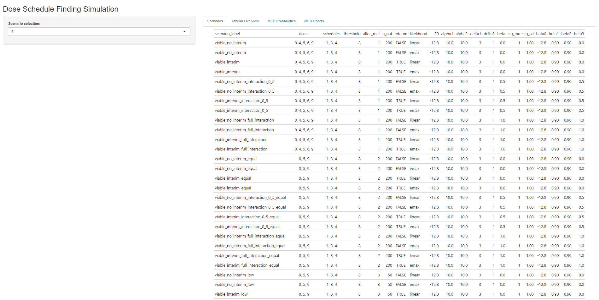
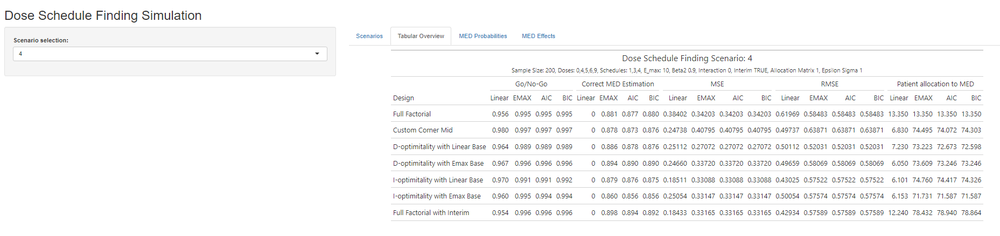
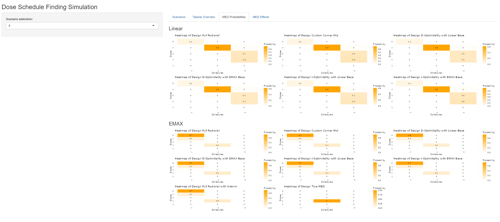
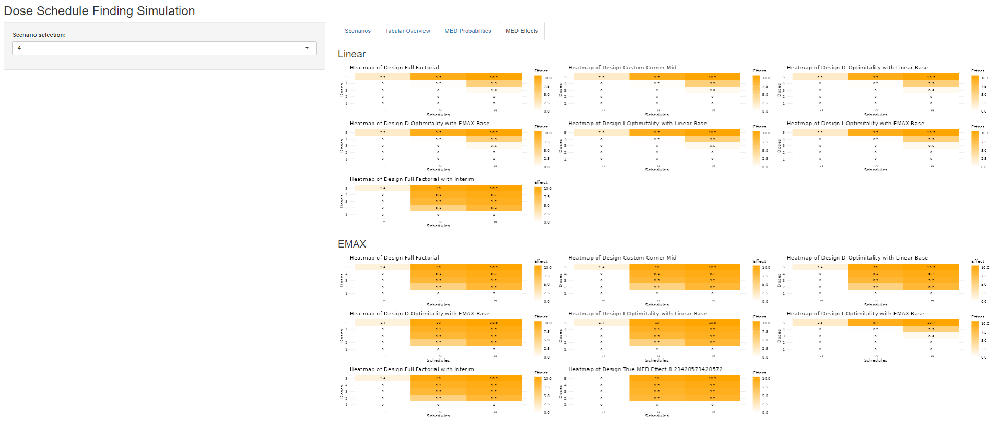

<!-- badges: start -->

[](https://github.com/Xyarz/DoseScheduleOptimizeR/actions/workflows/R-CMD-check.yaml) <!-- badges: end -->

# DoseScheduleOptimizeR

Dose Schedule Optimization - Simulation based

## Installation

``` r
install.packages("remotes")
remotes::install_github("https://github.com/xyarz/DoseScheduleOptimizeR")
```

## Usage of ShinyApp

``` r
library(DoseScheduleOptimizeR)

DoseScheduleOptimizeR::runApp()
```

Inside the R Package, there is also an R Shiny application available. The aim of the application is briefly investigate some simulations and changes yourself. When opening the application, one will find themselves on a Landing page, as depicted below. On the left side, there are all the parameters being necessary for the simulation to run, with usable default values for direct interaction. At the bottom on the left side, there is a button, which states "run sims". If that is being pressed, all changes on the parameters are assessed and if needed the simulation is being re-run. The Landing page also provides a tabular overview of the available scenarios that can be investigated. Right now, the application is restricted to one iteration and the pre-specified scenarios (93 in total). The goal for the future is to open that up completely and let the user fully choose what parameter combinations to run.





This figure depicts, the second tab of the application, which shows the tabular overview of the simulation results, similar to those shown within this thesis.

Here, we can see the third tab of the app, which showcases the MED probabilities heatmaps for the chosen scenario.



The last tab of the application shows the MED effect heatmaps of the ran scenario.



## Further Information
